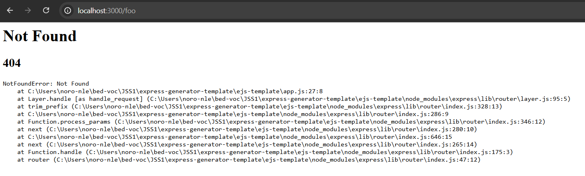
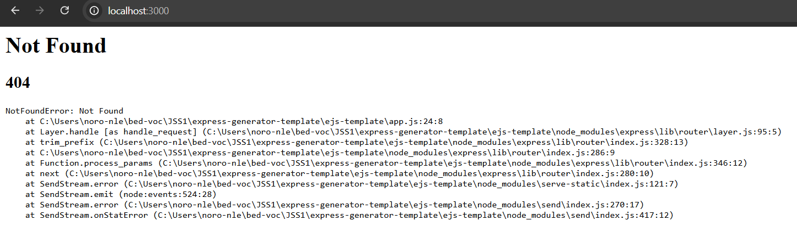
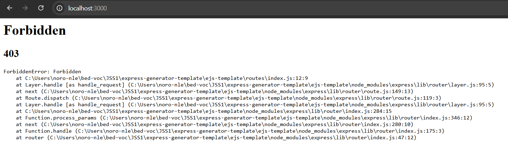
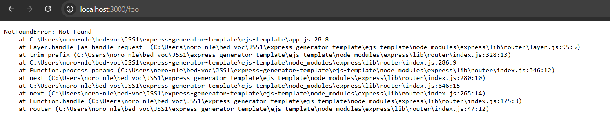

# Express-generator template

This project exists to explain the template produced by the express-generator using EJS as our view engine.
This template is a project that was last updated 6 years ago and does not include some modern JavaScript practices. 

It contains what, at the time, the express developers felt were necessary to create a production ready full-stack web application with the ability to scale. There are dependencies in this project that you do not need to use for the assignment, as we are not using many of the features, which can result in it feeling overwhelming and difficult to understand without help. This document aims to clarify what you need to actually pay attention to, while explaining - at a high level - what all these dependencies do.

Note: Express is an __unopinionated__ framework which means it comes with nothing out the box and everything you feel you need is added via dependencies. This is why you find many different dependencies in this template - it is vital to keep in mind that you dont **need** all these to use express.

To keep this as simple as possible, no other dependencies will be installed - the starter code for the assignment contains largely the base template with a few small additions.  

None of the code seen in this project you write yourself, it is all generated.

**Remember**, to view formatted markdown in VSCode you use the `ctrl-shift-v` shortcut.

## Table of Contents

1. [Installation](#installation)
2. [Startup Walkthrough](#startup-walkthrough)
3. [Logging with Morgan](#logging-with-morgan)
4. [Error Handling](#error-handling)
5. [debug package](#debug-package)
6. [cookie-parser package](#cookie-parser-package)
7. [Key points/summary](#key-points-tldr)


## Installation

To generate a template we need to install the `express-generator`:

```bash
npm i express-generator -g
```

The `-g` flag simply tells npm to install this dependency globally, so we dont need to repeat this command for every new project. 

**Note**: this means that `express-generator` will not appear in the `package.json` file as that contains dependencies for the current project. 

This enables the `express` command globally, allowing us to use the generator to make some project templates.

Express is a full stack web application framework, meaning it can be used for only backend (making APIs exchanging JSON and handling communication through HTTP codes and methods), only frontend (by serving static files), or full-stack using view engines to include server-side logic in our client side pages.

What we are doing in this course and assignment is creating a full-stack web application using Embedded JS (EJS) as the view engine. This means that endpoints (aka routes) we create are not to return data but to render views. 

**Note**: You only need to generate a template for new projects. You **do not** need to generate one in this project, or the assignment as it has already been done for you.

Once we have the generator installed, we can create a template by running the following command:

```bash
express ejs-template --ejs
```

The first arguement is using the express generator, the second arguement is the name of our project to be created (`ejs-template`) and the third is a flag (`--`) to tell the express generator to use `ejs` as our view engine.

This creates a folder called `ejs-template` which contains our generated project. You can open that folder in VSCode and start browsing the code.

To install all the required dependencies, run the following:

```bash
npm i 
```

You'll see there are several warnings about vulnerabilities. These vulnerabilities come from outdated dependencies due to the generators age. Since it’s primarily a learning tool, express-generator hasn't received regular updates to align with modern practices or security standards.

We can fix these issues by updating the dependencies in the template oursevles with:

```bash
npm audit fix --force 
```

This will update all the dependencies to the latest (and hopefully secure) versions, the `--force` flag ignores the package version ranges stated in `package.json` in favour of fetching the latest versions. While this is safe to do in our small educational demo, in real production you would not `--force` without careful consideration of breaking changes. This is normally a very time consuming process.

To test if the updates broke anything, run:

```bash
npm run start
```

Then navigate to `http://localhost:3000`, you should see a 'welcome to express' message. The last bit of setup we need to do before we can explore the project is make sure you have support for EJS in VSCode - otherwise you'll be coding blind. 

To include support for EJS syntax in VSCode we need to install an extension called `EJS language support` (from the Extensions tab in the explorer). This adds support for all the `<%` tags and snippets to help us with the syntax. We will look at those another time, as this project is just to explain what is here by default without focussing on how to use EJS or PassportJS.

## Startup walkthrough

Now that we have all the setup needed, lets start exploring the project template and discuss why its structured this way. The simplest place to start is `package.json` where we can see the depenencies that this template uses as well as how you run the templated application.

```json
{
  "name": "ejs-template",
  "version": "0.0.0",
  "private": true,
  "scripts": {
    "start": "node ./bin/www"
  },
  "dependencies": {
    "cookie-parser": "~1.4.4",
    "debug": "~2.6.9",
    "ejs": "~2.6.1",
    "express": "~4.16.1",
    "http-errors": "~1.6.3",
    "morgan": "~1.9.1"
  }
}
```

As you can see, there are many dependencies in addition to `ejs` and `express`, which is all we needed with a normal express app. We will cover what each of these dependencies are for in later sections, what we need to focus on first is the aspect that makes template very different from a normal express app. The **entrypoint**.

### bin/www entrypoint

If you look in `package.json` in the scripts section, you can see where the entrypoint is defined.

Recall, an entrypoint is where you run the application from and is commonly written as a script to avoid having to repeat the startup command and simply type `npm run start` or something similar. The entrypoint for this application is detailed in the `start` script below:

```json
"scripts": {
    "start": "node ./bin/www"
  },
```

Before we dive into the `www` file and see why its the entrypoint, lets remind ourselves of a normal express app's entrypoint.

When we make an express app, we often define either `app.js` or `server.js` as the entrypoint, to align with this template let's choose `app.js`. Inside this file we write the setup to configure and launch an express server:

```js
// app.js (in a normal express app, not in the generated template)
const express = require('express')
const app = express()

const port = process.env.PORT || 3000

app.listen(port, () => {
    console.log(`Server listening at http://localhost:${port}`)
})
```

And your entrypoint is typically confugured as such:

```json
"scripts": {
    "start": "node app.js"
  },
```

This code creates an instance of `express` to use, configures a `port` for our server to listen on, and then asks the server to start listening on that port. Then when it starts listening, the **callback** function is invoked (using the ES6+ arrow syntax) and our message is logged to the console.

We are then free to add any endpoints, configure routes, configure a view engine, add any middleware, and include and static files we need.

Now lets see how the express-generator template compares.

If we navigate to `app.js` in our template, we see the following with unesseary details ommited and replaced by `...`:

```js
// app.js (from the template)
...
var express = require('express');
...
var app = express();
...
module.exports = app;
```

We can see that there is no port configured and no listen method invoked, but we see that `app` is exported. This is where the `bin/www` entrypoint comes into play.

**Note**: They use `var` here because, as mentioned in the beginning, this was last maintained 6 years ago and does not include modern JavaScript features (like using `const` and `let` instead of `var`).

If we navigate to the `bin/www` file, we see the following (with the same style of ommision as before):

```js
// www
...
var app = require('../app');
...
var http = require('http');
...

var port = normalizePort(process.env.PORT || '3000');
app.set('port', port);

var server = http.createServer(app);

server.listen(port);
...

server.on('listening', onListening);

function onListening() {
  // Called once the server is running
}
```

**Note**: We will come back later to discuss more details in the `www` file as there are many new dependencies, right now we are simply focussing on the server configuration and how it is different from what you would see using express without this template.

Before we look at the specific implementation details, let’s take a step back and see that this is where we configure our port and configure our server to listen. The question we need to consider before moving on is why?

Why is the server configuration in a separate file?

The answer is separation of concerns. While we have not covered enough to detail how this allows our applications to scale, all you need to understand for now is that:

Separation of concerns means keeping different responsibilities of your application in separate places. Here, `app.js` handles the app setup — middleware, routes, etc.

While `bin/www` focuses on starting the server and configuring it (like setting the port). This makes the code clearer, reusable, and easier to manage as the app grows.

As for the name `bin/www`, it follows a Unix-like convention where `bin` stands for "binary" and often contains executable files or scripts. In this case, `www` acts as the script to launch the server. It’s just a naming choice from the template, and while it’s not mandatory, it aligns with a common practice for organizing entry points.

Now that we’ve addressed the why, let’s address the how. You’ll notice that the code feels familiar but, at the same time, a little foreign.

In this template, the `http` module is used to create a server by wrapping the Express app with `http.createServer(app)`. Express itself is built on top of the `http` module, so this setup exposes lower-level functionality if needed, such as handling raw HTTP requests or customizing server behavior. You are not expected to use these advanced features, so for your purposes, this is functionally the same as using `app` with `app.listen`.

Instead of writing the callback for `listen` inline using arrow syntax, the `onListening` event is separately registered with `server.on('listening', onListening)`. This is similar to how you registered events in the DOM while working with HTML. Recall, that this template was created without the use of arrow functions, which is why the server listen event and callback are configured this way instead of in a single line as with arrow functions.

You’ll also notice the line `app.set('port', port)`, which stores the port in the app's configuration, making it accessible elsewhere if needed. However, this does not configure the server to listen on that port. The `server.listen(port)` line is what actually starts the server and binds it to the port.

This separation adds flexibility that was useful for production apps at the time the template was created, but it’s not something you’ll need to worry about in this course.

In summary, `www` handles the server configuration (port assignment and event registration) while `app.js` contains application logic (routes, middleware, etc.). This template wraps express in an http server to expose lower level features which we do not use, so in your mind you can replace `server` with `app` as it is functionally the same as what you are used to with a normal express app. 

Finally, the body of the `onListening` function is where we place any code that we want to **execute when the application starts** - if you take anything away from this section, it is this line. 

Now that we have seen how the server setup is configured, we can start discussing some of the depenencies seen in the project.

## Logging with morgan

Recall, we could write our own middleware with express and use it to log every request to the server by writing something like this:

```js
// Custom logger middleware
app.use(function(req, res, next) {
  console.log(`Incoming request: ${req.method} ${req.url}`);
  next(); // Pass control to the next middleware/route
});
```

The package `morgan` essentially does the same thing. Let's see how it is used in the template:

```js
// app.js
...
var logger = require('morgan');
...
app.use(logger('dev'));
...
```

Here we create an instance by passing `dev` as the configuration, resulting in logs in the following format:

```text
:method :url :status :response-time ms - :res[content-length]
```

You can find a link to the relevant section in npm [here](https://www.npmjs.com/package/morgan#dev). To see the output of the log, run the server and navigate to `http://localhost:3000` this will trigger our `index` route and render the `index.ejs` view, with the following being logged to the console:

```text
GET / 200 1.538 ms - 207
GET /stylesheets/style.css 200 3.930 ms - 111
GET /favicon.ico 404 2.851 ms - 1403
```

Here we can see three events have been logged as the server was pinged three times by the browser. The first time was a GET request to `/` which happened when we entered `http://localhost:3000` into the browser. This resulted in a status code of `200 Ok` and our view was rendered by the server and returned to the browser.

Next the browser parsed the HTML and got to the line `<link rel='stylesheet' href='/stylesheets/style.css' />` where it made a request to our server for that resource, which can be seen as the second GET request to `/stylesheets/style.css` which also resulted in a `200 Ok` because we have included the public folder using the `express.static` middleware which contains all our stylesheets, client side JavaScript, and images. This can be seen in the following line:

```js
// app.js
...
app.use(express.static(path.join(__dirname, 'public')));
...
```

And finally, as usual, the browser makes a request for the favicon (the little picture in the browser tab) and because we have none, it results in a `404 Not Found` response from the server.

Interestingly if you refresh the page the following gets logged:

```text
GET / 304 2.958 ms - -
GET /stylesheets/style.css 304 1.346 ms - -
```

Notice the status code is different. A 304 means the browser is using a **cached** version of the resource instead of downloading it again. This happens because the browser checks with the server to see if the resource has changed, and if it hasn’t, the server responds with `304 Not Modified`, saving bandwidth and time. This is not something we needed to configure or worry about, its just an example of the performance improvements made over the years.

Now that we have seen how the logger is configured and works, let's move onto the templated error handling.

## Error handling

There are two main areas where errors are caught in this template, in the server configuration (`www`) and in the application configuration (`app.js`).

Once again, this is due to the nature of this template being a scalable production ready template for the time and our concerns are separated.

### Server configuration errors

Let's first cover error handling for the server, as it differs from error handling within the application itself.

If we look at the `www` file, we’ll find the following `onError` event handler:

```js
function onError(error) {
  if (error.syscall !== 'listen') {
    throw error;
  }

  var bind = typeof port === 'string'
    ? 'Pipe ' + port
    : 'Port ' + port;

  // handle specific listen errors with friendly messages
  switch (error.code) {
    case 'EACCES':
      console.error(bind + ' requires elevated privileges');
      process.exit(1);
      break;
    case 'EADDRINUSE':
      console.error(bind + ' is already in use');
      process.exit(1);
      break;
    default:
      throw error;
  }
}
```

We do not need to go into detail of the code itself, let’s simply consider when these errors might occur. Since this error event is attached to the HTTP server itself, it’s unrelated to user actions. Instead, it is triggered when the server fails to start due to a system-level issue. By examining the error cases, we can understand these potential issues:

- `EACCES` is an error occurs when the server requires elevated privileges to access the specified port (e.g., trying to bind to a port 3000 without administrative rights).
- `EADDRINUSE` happens when the specified port is already in use, often due to another process or application running on the same port.

These are common issues encountered during application deployment, especially when deploying to shared production servers or bare-metal systems within a company’s infrastructure. While virtual machines and modern cloud services often avoid such conflicts through automated setup, you may still encounter these errors in less controlled environments.

That’s why this error handling is included in the production-ready template. However, since we are running everything on our local machines and not deploying to a production server, these errors are unlikely to occur. You can safely look past this section of the codebase for now and focus on the parts that directly impact your application.

On that note, lets go to `app.js` and see how application errors are handled.

### Application errors

These are errors that are used by users interacting with the application. The big difference here is that the errors arent just logged to the server, they need to be formatted and shown back to the user to inform them of what happened. 

We have middleware to catch any routes that are not configured, this can be be seen in the code below:

```js
// app.js
...
var createError = require('http-errors');
...
// catch 404 and forward to error handler
app.use(function(req, res, next) {
  next(createError(404));
});
```

Before we detail how this works, lets see it in action. If we run the applicaiton and navigate to a route we have not configured, say `http://localhost:3000/foo` we get the following error displayed to us:



We see that an HTML page is rendered which shows the error and a call stack so we can track where the error has been. Now the question is, how did this happen? How did it know what to render and how did express know to show this page to the user. It is not evident looking at this code by itself. While these are valid questions and we will get to the we first need to understand why this error was triggered in the first place.

The obvious answer is that we dont have a route for `/foo`, but how did the application know that? The answer is in the placement of the middleware we see in the code snippet above. To see this point clearer, lets remind ourselves that code is read top to bottom, meaning the placement of middleware is crucial in its function. If we look at the same code again, but include some context about the registered routes the picture becomes clearer:

```js
// app.js
...
var createError = require('http-errors');
...
app.use('/', indexRouter);
app.use('/users', usersRouter);

// catch 404 and forward to error handler
app.use(function(req, res, next) {
  next(createError(404));
});
```

Notice here that we define our routes **before** our middleware that creates our error. Any request that makes it that far - meaning it doesnt match any of our defined routes, is a route that we have not defined. Which we would want to communicate to the user that what they are trying to access does not exist. Now, if we had to move our middleware above the route definitions, it would trigger before we define our routes, meaning any URL we enter will trigger this 404 error.

```js
// app.js
...
var createError = require('http-errors');
...
// catch 404 and forward to error handler
app.use(function(req, res, next) {
  next(createError(404));
});

app.use('/', indexRouter);
app.use('/users', usersRouter);
```

Once we restart the server, and navigate to `http://localhost:3000` we get the following:



Notice how we still get this error even when we navigate to a route we know exists. This shows how the order of middleware is important.

Now that we see how it the middleware functions, lets see how it knows to render a view to display the errors.

The key to understand this, is looking at the fact that our middleware creates an error object (it doesn't throw anything) and then passes this error object to the next middleware in the chain. This means we need to expand our code snippet to include more context:

```js
// app.js
...
var createError = require('http-errors');
...
// catch 404 and forward to error handler
app.use(function(req, res, next) {
  next(createError(404));
});

// error handler
app.use(function(err, req, res, next) {
  // set locals, only providing error in development
  res.locals.message = err.message;
  res.locals.error = req.app.get('env') === 'development' ? err : {};

  // render the error page
  res.status(err.status || 500);
  res.render('error');
});
```

We see that the next middleware in the chain is this function that renders an `error` view. The important thing to note about this is that this middleware if different in the fact that it takes 4 arguements (`err`, `req`, `res`, `next`). This identifies this middleware as [error handling middleware](https://expressjs.com/en/guide/using-middleware.html#middleware.error-handling) because it has four arguements, and express is configured to identify this as a custom error handler. 

**Note**: Express has a default error handler which we will detail once we have understood how this custom error handler works.

So, at a high level, once we have passed all our defined routes and the response has not been sent yet, we create a 404 error using `createError(404)` and then pass that object to the next middleware in the chain with `next(createError(404))` which passes it to our custom error handling middleware and our created error is passed as the `err` paramter to be used to render our `error` view. 

**Note**: We dont need to include req, res, and next in our next call since those are implicitly (by default) passed to all middleware functions. Recall, an express application is a chain of middleware calls (`app.set`, `app.use`, `app.get`, `app.post`, etc. are all just middleware).

Now that we have established the high level function of the error handling middleware, its worth taking a moment to see how `createError` works to better understand what we are seeing when our error views are rendered. 

If we look at the `http-errors` [npm page](https://www.npmjs.com/package/http-errors) it doesn't really detail all the variations without us having to look at the actual code to see how its constructed. 

In short, we can just proivide a status code to create an error from, and the package will create one of several different types of errors (Client, Server, and some others) based on the range of the status codes (400s for client errors - not including auth errors, 500s for server errors) - this mapping is **not important** to memorise, just understand there are different categories of errors that we create. 

Each error status code also has a message associated with it which this package adds to the error object (this can be overriden by passing your own message in the `createError` function as a second paramters - the template does not do this by default). 

The final property attached is the stack trace (the path the code took before it reached the error state).

In short, all you need to understand is that `createError` is an easy way to make a JS object containing useful information about errors by simply supplying the status code. This is then passed to the next middleware in the chain with `next` and that takes it in as an `err` parameter to then pass to an `error` view to render the error to the user without stopping the server.

To see how this works, instead of calling `next` lets log the created error (this is done purely for educational purposes and we will change it all back at the end):

```js
// app.js
...
app.use(function(req, res, next) {
  console.log(createError(404));
});
...
```

Now if we restart the server, and navigate to `http://localhost:3000/foo` we can see the following logged to the console:

```text
Server running
ClientError [NotFoundError]: Not Found
    at C:\Users\noro-nle\bed-voc\JSS1\express-generator-template\ejs-template\app.js:28:15
    at Layer.handle [as handle_request] (C:\Users\noro-nle\bed-voc\JSS1\express-generator-template\ejs-template\node_modules\express\lib\router\layer.js:95:5)   
    at trim_prefix (C:\Users\noro-nle\bed-voc\JSS1\express-generator-template\ejs-template\node_modules\express\lib\router\index.js:328:13)
    at C:\Users\noro-nle\bed-voc\JSS1\express-generator-template\ejs-template\node_modules\express\lib\router\index.js:286:9
    at Function.process_params (C:\Users\noro-nle\bed-voc\JSS1\express-generator-template\ejs-template\node_modules\express\lib\router\index.js:346:12)
    at next (C:\Users\noro-nle\bed-voc\JSS1\express-generator-template\ejs-template\node_modules\express\lib\router\index.js:280:10)
    at C:\Users\noro-nle\bed-voc\JSS1\express-generator-template\ejs-template\node_modules\express\lib\router\index.js:646:15
    at next (C:\Users\noro-nle\bed-voc\JSS1\express-generator-template\ejs-template\node_modules\express\lib\router\index.js:265:14)
    at Function.handle (C:\Users\noro-nle\bed-voc\JSS1\express-generator-template\ejs-template\node_modules\express\lib\router\index.js:175:3)
    at router (C:\Users\noro-nle\bed-voc\JSS1\express-generator-template\ejs-template\node_modules\express\lib\router\index.js:47:12)
```

Notice how from just supplying 404 as the error code, we get the type of error is it, a short message to say whats happened and a path to the error. 

**Note**: You will notice our web application hangs (the browser tab keeps refreshing and nothing happens) this is because we dont send a resonse or call the next middleware, making our application __stuck__. Recall, we are doing this to see how the error looks, we will return everything to working order when we are done. 

If we change the error to something else, we can see how this changes:

```js
// app.js
...
app.use(function(req, res, next) {
  console.log(createError(502));
});
...
```

The following is logged:

```text
ServerError [BadGatewayError]: Bad Gateway
    at C:\Users\noro-nle\bed-voc\JSS1\express-generator-template\ejs-template\app.js:28:15
    at Layer.handle [as handle_request] (C:\Users\noro-nle\bed-voc\JSS1\express-generator-template\ejs-template\node_modules\express\lib\router\layer.js:95:5)   
    at trim_prefix (C:\Users\noro-nle\bed-voc\JSS1\express-generator-template\ejs-template\node_modules\express\lib\router\index.js:328:13)
    at C:\Users\noro-nle\bed-voc\JSS1\express-generator-template\ejs-template\node_modules\express\lib\router\index.js:286:9
    at Function.process_params (C:\Users\noro-nle\bed-voc\JSS1\express-generator-template\ejs-template\node_modules\express\lib\router\index.js:346:12)
    at next (C:\Users\noro-nle\bed-voc\JSS1\express-generator-template\ejs-template\node_modules\express\lib\router\index.js:280:10)
    at C:\Users\noro-nle\bed-voc\JSS1\express-generator-template\ejs-template\node_modules\express\lib\router\index.js:646:15
    at next (C:\Users\noro-nle\bed-voc\JSS1\express-generator-template\ejs-template\node_modules\express\lib\router\index.js:265:14)
    at Function.handle (C:\Users\noro-nle\bed-voc\JSS1\express-generator-template\ejs-template\node_modules\express\lib\router\index.js:175:3)
    at router (C:\Users\noro-nle\bed-voc\JSS1\express-generator-template\ejs-template\node_modules\express\lib\router\index.js:47:12)
``` 

As you can see, its a differnt kind of error (server error) with its own message and the trace once again. This illustrates how the `http-errors` dependency constructs its error objects.

If we return our code back to working order, with the correct error (404), we can now see how the error view renders the error object passed to it:

```js
// app.js
...
var createError = require('http-errors');
...
// catch 404 and forward to error handler
app.use(function(req, res, next) {
  next(createError(404));
});

// error handler
app.use(function(err, req, res, next) {
  // set locals, only providing error in development
  res.locals.message = err.message;
  res.locals.error = req.app.get('env') === 'development' ? err : {};

  // render the error page
  res.status(err.status || 500);
  res.render('error');
});
```

```html
<!-- views/error.ejs -->
<h1><%= message %></h1>
<h2><%= error.status %></h2>
<pre><%= error.stack %></pre>
```

Resulting in the following being shown to the user:


In the error handling middleware code you'll notice that the error object wasn’t explicitly passed to the view using something like `res.render('error', { message: err.message, error: err });`. Instead, it uses `locals`, which are automatically accessible in every EJS view for the current request only. This means that only the view being rendered for that specific request — in this case `error` — has access to the variables stored in `res.locals`. This is just a choice the developers made to keep the view calls cleaner.

Separately, the developers of this template chose to control what error information is displayed based on the application's environment. Specifically:

- In development, full error details (including the stack) are provided to aid debugging.
- In production, only the message is exposed, as revealing full error details (like the stack) could pose a security risk by exposing sensitive implementation details.

This behavior—hiding or showing details based on the environment — is not tied to the use of `res.locals`. It is simply a separate part of the error-handling logic and something similar should be present in every production system. 

The same effect could also have been achieved by explicitly passing the error object to the view using `res.render`. Both approaches are valid.

**Note**: You are not expected to be able to run the application in these different enviroments and cater for their differences at this point in the program. Later on we will cover deploying to production environments.

Phew, that was a lot, maybe take a breath or two. 

Now that we have seen the mechanics of the error handling in this template, maybe you have the question in your head about `throw`. So far, the only way we have invoked the error handler explicitly by calling `next`, what if we have errors somewhere else in the express app which are thrown with the `throw` keyowrd, will this middleware be invoked? 

The answer is yes, recall, Express has a mechanism for error handling (which we are providing a custom implementation of) and that means any errors that happen anywhere in the express app will be caught and handled by this middleware and shown in the `error.ejs` view. To demonstrate this, lets go our `index` route and instead of rendering the default "hello express" view, lets throw an error and see what happens when we call that route:

```js
// routes/index.js
var express = require('express');
var router = express.Router();
var createError = require('http-errors') // Added

/* GET home page. */
router.get('/', function(req, res, next) {
  /* 
    Using the http-errors dependeny to create an error object, then throwing it.
    This error then is caught by express' error handling to prevent the application from crashing.
    This invokes our custom error middleware and renders the error.ejs view as before.
  */
  throw createError(403) // Choosing a random error code to make sure its this error being shown
  res.render('index', { title: 'Express' }); // This will never be rendered since we exit the scope with throw, it's effectively dead code.
});

module.exports = router;
```

Restarting the server and navigating to `http://localhost:3000` we see the follwing:



Now we can see that any error we `throw` will be handled my the middleware. Meaning we could technically change our 404 catcher to the following and it will still work the same:

```js
// catch 404 and forward to error handler
app.use(function(req, res, next) {
  throw createError(404);
});
```

Its not done this way because it is the second last middleware in the chain (before error handling, which always should be the last step in the request response cycle) and its cleaner to just call `next` instead of throwing an error.

Before we take a moment to see how the default express error handler works, lets return our code to normal:

```js
// routes/index.js
var express = require('express');
var router = express.Router();

/* GET home page. */
router.get('/', function(req, res, next) {
  res.render('index', { title: 'Express' });
});

module.exports = router;
```

```js
// app.js
...
// catch 404 and forward to error handler
app.use(function(req, res, next) {
  next(createError(404));
});
...
```

Okay, now that everything is back to normal. Lets remove our custom error handler and see how Express handles errors by default.

```js
// app.js
...

var indexRouter = require('./routes/index');
var usersRouter = require('./routes/users');

var app = express();

...


app.use('/', indexRouter);
app.use('/users', usersRouter);

// catch 404 and forward to error handler
app.use(function(req, res, next) {
  next(createError(404));
});

// error handler (commenting out to see default behaviour)
// app.use(function(err, req, res, next) {
//   // set locals, only providing error in development
//   res.locals.message = err.message;
//   res.locals.error = req.app.get('env') === 'development' ? err : {};

//   // render the error page
//   res.status(err.status || 500);
//   res.render('error');
// });

module.exports = app;
``` 

For reference, [here](https://expressjs.com/en/guide/error-handling.html) is the documentation about how express handles errors.
Errors can be triggered by calling `next(err)` or by using `throw` with an error object.

Recall that `next(err)` invokes the error-handling middleware, which follows the specific four-argument structure `(err, req, res, next)`. Express is configured to look for middleware with this structure (or use its own) and assumes the first parameter `(err)` represents an error. This assumption is due to JavaScript’s lack of static typing, where function signatures don’t enforce specific argument types. If you try make middleware with four arguments Express will **always** assume it's for error handling.

Now that we have removed our custom implementation, lets restart and navigate to `http://localhost:3000/foo` and see what happens:



And if we look at the server logs, we see the error also logged there:

```text
NotFoundError: Not Found
    at C:\Users\noro-nle\bed-voc\JSS1\express-generator-template\ejs-template\app.js:28:8
    at Layer.handle [as handle_request] (C:\Users\noro-nle\bed-voc\JSS1\express-generator-template\ejs-template\node_modules\express\lib\router\layer.js:95:5)   
    at trim_prefix (C:\Users\noro-nle\bed-voc\JSS1\express-generator-template\ejs-template\node_modules\express\lib\router\index.js:328:13)
    at C:\Users\noro-nle\bed-voc\JSS1\express-generator-template\ejs-template\node_modules\express\lib\router\index.js:286:9
    at Function.process_params (C:\Users\noro-nle\bed-voc\JSS1\express-generator-template\ejs-template\node_modules\express\lib\router\index.js:346:12)
    at next (C:\Users\noro-nle\bed-voc\JSS1\express-generator-template\ejs-template\node_modules\express\lib\router\index.js:280:10)
    at C:\Users\noro-nle\bed-voc\JSS1\express-generator-template\ejs-template\node_modules\express\lib\router\index.js:646:15
    at next (C:\Users\noro-nle\bed-voc\JSS1\express-generator-template\ejs-template\node_modules\express\lib\router\index.js:265:14)
    at Function.handle (C:\Users\noro-nle\bed-voc\JSS1\express-generator-template\ejs-template\node_modules\express\lib\router\index.js:175:3)
    at router (C:\Users\noro-nle\bed-voc\JSS1\express-generator-template\ejs-template\node_modules\express\lib\router\index.js:47:12)
```

Notice how the HTML page we see if different to our custom `error.ejs` view. This is the default, built-in error handling HTML page for express. Also, our custom error handling didnt log the error the console like the default behaviour does.

Now that we have seen how the default error handler works, we can revert our changes back to our custom error handling by uncommenting the code we just commented out. 

**Note**: Errors thrown in `bin/www` are not handled by express and wont be rendered to the user. Recall, `www` exists to seprate the concern of server configuration, and it is not an express app we thats created, but an **http server** that wraps our express app, so the express error handling cant apply to it - and its why we see the `onError` event handler in that file. Once again, this is a choice by the developers to separate server from application - something that was more of a consideration before cloud services which now handle alot of this responsibilty for us. 

You can breath again, we are done with the error handling section now. Since this was such a long section with moving parts, the key points are sumarised below. 

**Note**: You are **not expected** to implement anything error handling related for the assignment, or change any of the default configurations. All that is required of you is to simply understand that the errors you see are rendered because of the custom error handling middleware implemented in this template. 

### Error handling summary

Express has default error handling that renders an HTML page with the details of any error that is either thrown (using `throw`) or passed to the error handling middleware using `next(err)`. The error handling middleware is the **only** middleware in express that has four arguements `(err, req, res, next)` so writing `next(err)` anywhere in the express application will invoke the error handling. 

The express-enerator template provides its own implementation of this error handling by defining a middleware function with these four arguements (in `app.js`), which express is hard coded to understand as an error handler. What this custom error handler replaces the default one and all it does is pass the error (with different details for a `dev` or `prod` environment) to an EJS view to provide details to the user (you). It does not log the error to the server console to keep it clean.

This error handling mechanism does not apply to code in the `bin/www` file as that is the server configuration and its done using `http` to wrap express, and it handles errors its own way - through the `onError` event handler. This simply logs errors to the console. So there is a differentiation between server and applicaiton errors (one is logged, the other is rendered and shown to the user).

You are **not expected** to alter or augment (add to) this error handling mechanism in any way for the assignments. You simply need to recognise the errors it produces and use them to help you debug.

The remaining sections are not as long and complicated as the ones we have covered so far. They are smaller dependencies that we, in large part, dont ever use and they are configured with defaults so the code is minimal. I will still cover them so you get the full picture and are able to clearly deliniate (separate) what you need to worry about using vs what you can simply conceptually understand. 

## debug package

In the `bin/www` file you'll find this line of code:

```js
var debug = require('debug')('ejs-template:server');
```

This references a package called [debug](https://www.npmjs.com/package/debug), which is a lightweight utility designed to assist with debugging by providing more structured and visually distinct logging. Instead of directly using `console.error` or `console.log`, you use the debug function to produce logs that can be selectively enabled or disabled and formatted with colors.

To use it, you pass a namespace (in this case, `ejs-template:server`) to the debug function. This namespace acts as a label for your logs, helping you distinguish between different parts of your application. The debug function returns a logging function, which you can then call to produce debug messages.

**Note**: The :`server` suffix is a namespace convention used in the Express template to organize debug logs by functionality. While not required by the debug package, it allows selective debugging and better log organization in larger applications. You can use similar namespaces (e.g., `:db`, `:auth`, `:routes`) to track logs from different parts of your application.

It is only used in one instance:

```js
/**
 * Event listener for HTTP server "listening" event.
 */

function onListening() {
 ...
  debug('Listening on ' + bind);
}
```

And if you run the application you wont even see anything, why?

The debug package relies on the DEBUG environment variable to determine which logs to output. If the `DEBUG` environment variable is not set, messages generated by `debug()` won’t appear in the console.

One way to actually get the debug messages to show is to change the start script to:

```bash
DEBUG=ejs-template:server node ./bin/www
```

Which adds the `DEBUG` environment variable to the application, which will enable the logs to be seen - you could also add this with a `.env` file and the `dotenv` package, or any other method.

The express-generator template doesn’t enable debug output by default because it’s designed to work in both development and production environments. Debug logs can clutter output in production, so they're opt-in to give you control.

Now, what do you **have** to do with this for the assignments? **Nothing**, although, I encourage you to experiment with it. It is a useful package that can help you sift through all the `console.log` statements you may normally use. The namespace feature (`:app`, `:auth`) may help you identify if the errors are because of your application logic or the logic for `passport.js` - ofcource you'd have to do all this yourself, but it could be useful to see a "password was confirmed" type log which is visually distinct from a "object passed to view" log.

## cookie-parser package

In `app.js` you'll find these lines of code:

```js
// app.js
...
var cookieParser = require('cookie-parser');
...
app.use(cookieParser());
```

This imports the dependency and then adds it as middleware. This package has a simple function, parse (read) cookies that have been sent by the browser on the request. It cannot add cookies to the response, because Express already does that by default. I hear you asking, but why?

Writing cookies is simple because the server controls their format using the `Set-Cookie` header. Reading cookies is more complex because the Cookie header can include multiple cookies, special characters, and malformed data. Express leaves parsing to middleware like `cookie-parser` and performs the standard writing itself. This is, once again, down to express being unopinonated (it doesn't force a particular way unless its the only way), so almost everything you want to do is a dependency.

Are you expected to write and read cookies for this assignment, **no**.

That covers all the dependencies that are not part of the normal express approach, and hopefully you can see their value, but also understand what is relevant for you.

## Key points (TLDR)

Express is an unopinionated web framework, this means it does everything that is standard and has one way to do it, but **everything** else is deferred. This means everything you want to do is an external dependency that is added to the express middleware. This template is a collection of middleware that the express team believed were needed to create a production-ready and scalable full-stack application at the time.

The express-generator template was written without ES6+ standards, so you will not see arrow functions and all variables will be `var` instead of `let` or `const`. Please stick to the modern conventions you are used to when adding your code.

The first thing you'll notice is the `bin/www` file with all the configuration for the server there, and all the configuration for the application in `app.js`. You'll also see that `app` is exported from `app.js` and then imported in `www` to be wrapped in an `http` server and instead started there. Recall, the template was created to be production ready and scalable - importantly, for the time it was written. They are **separating the concern** of server configuration and application configuration, so that the logic and error handling for the server itself is contained in `www` and done in its own way. Then all the application configuration and its errors are configured in `app.js` and done in thier own way. All you need to understand is that the event handler `onListening` (at the bottom of `www`) can be treated the same as the `app.listen(port, () => {})` callback when the server is run using express. This means that any code you want to **run when the application starts** must be placed in the body of the `onListening` function. Small note, cloud providers have taken alot of the server configuration responsibility away from the application itself so this separation isn't as common anymore.

This template also introduces some new dependencies that you would not have seen when using express by itself. These are briefly shown below:

`var createError = require('http-errors');` is a popular package ([http-errors](https://www.npmjs.com/package/http-errors)) that creates an error object when supplied with a status code (404 for Not Found for example) with other information that is good to know for development. The template uses it to create detailed errors. You do not need to do anything with this as it setup for you, all that happens is you get a nice view showing your errors instead of the application crashing. The section on this contains much more detail, but this is all you **need** to know.

`var cookieParser = require('cookie-parser');` is a reference to a package called [cookie-parser](https://www.npmjs.com/package/cookie-parser) which provides a way to read cookies coming from the browser on each request. You **do not** need to do anything with cookies in this assignment, so it can safely be ignored. 

`var logger = require('morgan');` is a reference to a package called [morgan](https://www.npmjs.com/package/morgan) that provides a nice and simple way of setting up logging middleware. You'll see it when looking at the console as you make requests to the server (e.g., `GET /foo 404 19.314 ms - 1403`). You do not need to configure anything for this, just use its default configuration to help you see whats happening.

Finally, in `www` you'll see the following, `var debug = require('debug')('ejs-template:server');` which is a reference to a package called [debug](https://www.npmjs.com/package/debug) which provides an alternative to using `console.log` and `console.error` by making it visually disctint (different colours for example) allowing clearer debugging logs. It is not fully configured as it requires the presence of specific environment variables. You are not required to do anything with this, but I encourage you to try it and see of you find value in it.

**What do you need to be concerned with?**

All you need to do is the basic express mechanics covered in class in isolation. This means using `routes` and `views`.

You configure routes in `app.js` and all the logic for those routes (url confiuration, data you pass to views, and rendering those views) happens in each route file in the `routes` folder. You'll add all your ejs views (and partial views) in the `views` folder and use the ejs syntax to do conditional rendering.

`Passport.js` is required for the assignment and it is configured in the routes to create its session and add the user to it, which then can be used in the views to do conditional rendering (if user exists, show their name in the navbar, etc.). This document does not detail its usage, as it is focussed on explaining the template.

I understand its a lot, but it will make more sense as time goes on. Just focus on where you need to work and then you can explore and experiment with the other features of the template when you are more comfortable. 


